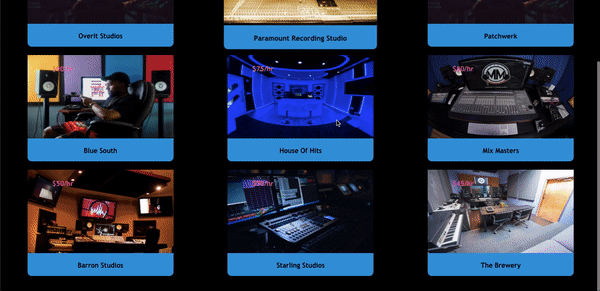

# Lab Locator

Lab Locator is a platform for freelance recording engineers to advertise/market their studios while allowing clients to leave feedback.




## Installation

Use the package manager npm to install dependencies

```bash
npm install
```

## Usage

```bash
#/lab-locator/backend
rails s

#/lab-locator/frontend
npm start
```

## Contributing
Pull requests are welcome. For major changes, please open an issue first to discuss what you would like to change.

Please make sure to update tests as appropriate.

## License
[MIT](https://choosealicense.com/licenses/mit/)